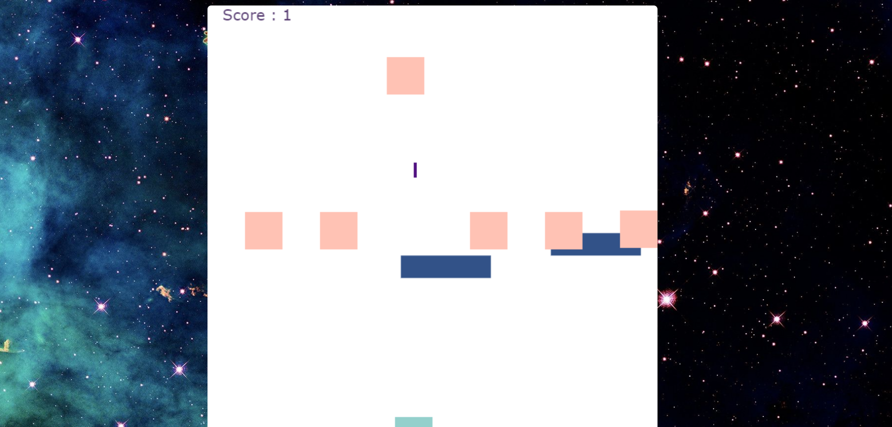

## Title Project :
Fire Game 

&nbsp;

## Description of the game:
The player moves left and right and he can hide under protection and can fire bullets towards the enemies, and if the number of firing shots reaches 50 shots, the big enemy appears and shoots the player here, the player tries to shoot at him and defeat him . 

&nbsp;
## Technologies used :
  * HTML5 Canvas
  * CSS
  * Java Script

&nbsp;

  ## Features will be added :
  * The big enemy shoots the player
  * Shots don't go through the block or protection 

&nbsp;

 ## Update feastures :
  * Graphic characters

